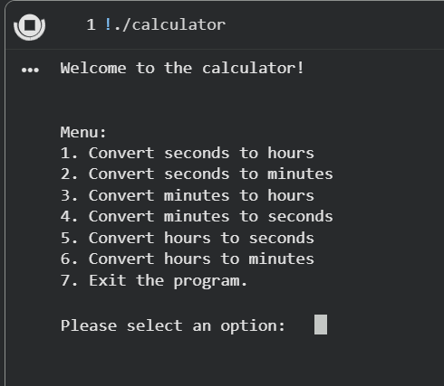

# Time-Conversion-Calculator
A C++ console-based time conversion calculator with input validation and a menu-driven interface.

# Time Conversion Calculator

A C++ console-based time conversion calculator that converts between seconds, minutes, and hours.  
Includes input validation, a menu-driven interface, and clean user prompts.

## Key Features
- Convert seconds to minutes or hours
- Convert minutes to seconds or hours
- Convert hours to minutes or seconds
- Validated non-negative input
- Menu-driven interface
- Clear error handling
- Simple and beginner-friendly structure

## How It Works
The program displays a menu with 7 options.  
The user selects a conversion, enters a value, and the program prints the result.  
Input is validated to prevent negative numbers or invalid characters.

## Technologies Used
- C++
- Standard Library (iostream, limits, string)

## How to Run
1. Compile the program:
g++ calculator.cpp -o calculator
2. Run it:
./calculator

## Screenshot
 

## Project Structure
Time-Conversion-Calculator/
├── calculator.cpp        # Main source code  
├── README.md             # Project documentation  
└── LICENSE               # MIT license  

## Future Improvements
- Add milliseconds and days conversion
- Add temperature or distance conversion modes
- Add a graphical user interface (GUI)
- Add color formatting for the console
- Add unit tests

## Contact
Created by Fatimah Sajjadali — feel free to reach out!

## License
This project is licensed under the MIT License.
